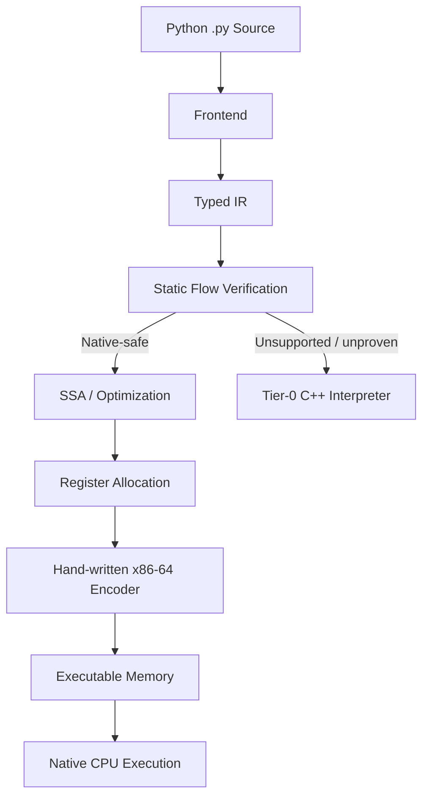

<div align="center">


# Lithon

### Native execution for typed Python.

[](https://github.com/Project-Lithon/lithon/actions)
[](https://en.cppreference.com/w/cpp/20)
[](https://en.wikipedia.org/wiki/X86-64)
[](#-static-typing)
[](LICENSE)

**Lithon is an experimental Python library and native x86-64 JIT that brings extended static typing, native execution, and explicit low-level memory access to Python code.**

</div>

---

<p align="center">
  
</p>

---

## 🚀 What is Lithon?

Lithon is a **Python library and native execution engine** that runs `.py`
source code using an extended **PEP-526-style static typing syntax**.

Lithon is designed to keep Python's familiar source-code model while giving
the compiler explicit type information that can be used for static verification,
native machine-code generation, and predictable execution.

Lithon is **not a separate programming language**. Python remains the source
language and `.py` remains the source format. Lithon extends the typing
information available to the compiler so that supported Python code can be
lowered to native x86-64 machine code.

For example:

```python
x: int[64] = 10
y: int[64] = 20

result: int[64] = x + y

print(result)
```

### Current status

**Lithon is an experimental/community-preview project.**

The compiler is already executing substantial typed programs natively and has
a verification suite covering machine-code encoding, ABI correctness, static
analysis, SSA, register allocation, floating point, containers, pointers,
AVX2 auto-vectorization, differential testing, and randomized fuzzing.

It is **not yet a stable production library** and should not be treated as a
drop-in Python replacement.

---

## ✨ Why Lithon?

Lithon is built around several principles:

* **Python source with extended PEP-526 typing** — Lithon works directly with
  `.py` source while providing additional type information to the native
  execution pipeline.
* **Mandatory static typing** — types are verified before execution.
* **Fixed-width values** — integer widths are explicit.
* **Native execution** — supported programs can execute as generated x86-64
  machine code.
* **No mandatory LLVM/Cranelift dependency** — the backend contains its own
  machine-code encoder.
* **Interpreter fallback** — unsupported native cases can still execute through
  Tier-0 when using automatic mode.
* **Explicit unsafe memory access** — pointer variables require an `_` prefix.
* **JIT/Compiler refusal over silent miscompilation** — when Lithon cannot prove
  something, the native tier refuses it.

The last point is fundamental to the project:

> **If Lithon cannot prove that a program satisfies the rules required by its
> native backend, it should refuse native compilation rather than guess.**

---

## 🧬 A Small Lithon Program

### Static integers

```python
a:int[64] = 20
b:int[64] = 22

result:int[64] = a + b

print(result)
```

Output:

```text
42
```

The width is part of the type:

```python
x:int[8] = 127
y:int[16] = 32000
z:int[64] = 9223372036854775807
```

Lithon does not silently turn these into arbitrary-precision Python integers.

---

## 🧠 Static Typing

Lithon's type checker is **unconditional**.

Removing annotations does not disable verification.

For example:

```python
x = 10
```

is rejected when a declaration requires an explicit type.

Instead:

```python
x:int[64] = 10
```

The compiler also checks:

* definite assignment
* branch type compatibility
* return types
* integer widths
* narrowing conversions
* function parameters
* container element types
* pointer types
* shift bounds
* container capacities

The principle is:

```text
Unknown / unprovable
        │
        ▼
     REFUSE
```

rather than:

```text
Unknown
  │
  ▼
Guess
  │
  ▼
     Generate potentially incorrect machine code
```

### Declaring without initializing

A declaration may omit the initializer. `x:int[8]` introduces the name and its
type without storing anything; the name starts **unassigned**:

```python
i:int[8]
i = 5
print(i)
```

This is accepted only where the name is definitely assigned before every read.
Reading it first is refused:

```text
RCR error: 'i' is not definitely assigned here (V1_SPEC 0.6.10)
```

An assignment inside one branch of an `if` does not count after it unless the
other branch assigns too, and a loop body never leaves a name assigned after the
loop. The first assignment is still range-checked, and the declaration emits no
code, so this generates exactly the same machine code as writing the initializer
in the declaration:

```python
i:int[8]
i = 5
print(i)
# same machine code as i:int[8] = 5 followed by print(i)
```

Re-declaring a name with a different type is refused: a name has one type.

---

## 🧷 Typed Pointers and Explicit Unsafe Variables

Lithon provides typed pointer values:

```python
i:int[16] = 16
_ptrI:ptr[int[16]] = addressof(i)

print(_ptrI)
print(valueof(_ptrI))
```

Example output:

```text
0x7fff330710e8
16
```

### Why the `_` matters

The `_` prefix is **mandatory** for pointer variables.

```python
_ptrI:ptr[int[16]] = addressof(i)
```

is valid.

A pointer variable without the required `_` prefix is rejected and does not
execute.

Likewise, a `_`-prefixed variable must satisfy the pointer rules.

This is Lithon's explicit unsafe-memory marker: the programmer can immediately
see which variables belong to the raw/native memory domain.

The mechanism is intentionally different from Rust's `unsafe` blocks, but the
design goal is similar:

> **Make potentially unsafe memory operations explicit instead of invisible.**

Current pointer support includes:

* `ptr[T]`
* `addressof()`
* `valueof()`
* typed pointer arithmetic
* compiler-enforced `_` naming
* static pointee typing
* protection against pointer promotion into ordinary registers
* frame-backed address stability

Pointers currently have deliberate restrictions. They cannot arbitrarily cross
function boundaries, point into unsupported containers, or be used as a generic
escape mechanism.

---

## ⚡ Native x86-64 Execution

Lithon's Tier-1 backend generates native x86-64 machine code directly.

The backend includes:

* hand-written x86-64 instruction encoding
* register allocation
* liveness analysis
* SSA / Phi handling
* branch emission
* stack-frame management
* floating-point SSE2 operations
* ABI-aware function calls
* CPU feature detection
* executable memory management

The generated code is placed into executable memory using the host operating
system's native facilities such as `mmap` / `VirtualAlloc`.

Lithon does **not** require LLVM or Cranelift to generate its native machine
code.

---

## 🏗️ Architecture

Lithon currently spans four implementation layers:

| Layer        | Language | Responsibility                                       |
| :----------- | :------- | :--------------------------------------------------- |
| **Frontend** | Python   | Source syntax, annotations, AST → IR                 |
| **Engine**   | C++20    | IR, type checking, analysis, optimization, execution |
| **Bridge**   | C        | ABI / native interoperability                        |
| **Backend**  | x86-64   | Machine-code encoding and emission                   |



---

## 🔀 Dual-Tier Execution

Lithon has two execution tiers.

### Tier-1 — Native

The preferred path.

```text
Lithon source
    ↓
Typed IR
    ↓
Static verification
    ↓
Optimization
    ↓
Register allocation
    ↓
x86-64 machine code
    ↓
CPU
```

### Tier-0 — Interpreter

The fallback path.

If a program uses functionality that the native backend cannot currently
support, automatic mode can execute it through the C++ interpreter.

This is useful during language development because unsupported features do not
have to block the entire execution pipeline.

### Strict mode

Use:

```bash
lithon program.py --strict
```

`--strict` means:

> **Native execution only. Refuse if Lithon cannot compile the program to the
> native tier.**

This is particularly useful for testing the compiler because successful output
cannot hide an interpreter fallback.

---

## 📦 Python Package

Lithon is being developed as a **Python library / package**, with a command-line
interface for compiling and running Lithon programs.

The project is **not yet released as a stable PyPI package**.

During development, the repository can be installed in editable mode:

```bash
pip install -e .
```

Then:

```bash
lithon program.py
```

Useful commands:

```bash
lithon program.py
lithon program.py --strict
lithon program.py --ir
lithon program.py -v
```

The current development package layout is still being consolidated before the
first public package release.

---

## ⚡ Quickstart

### Requirements

* CMake ≥ 3.20
* C++20 compiler
* Python ≥ 3.10
* x86-64 Linux or Windows environment for the current native backend

The C++ engine itself does not depend on LLVM or Cranelift.

### Build

```bash
git clone git@github.com:Project-Lithon/lithon.git
cd lithon

cmake -B build -DCMAKE_BUILD_TYPE=Release
cmake --build build -j$(nproc)
```

### Run through the development CLI

```bash
pip install -e .

lithon tests/programs/float.py
```

Native-only:

```bash
lithon tests/programs/float.py --strict
```

Print IR:

```bash
lithon tests/programs/float.py --ir
```

Verbose execution information:

```bash
lithon tests/programs/float.py -v
```

---

## 🧪 Verification

Lithon places unusually strong emphasis on **differential testing and
machine-level verification**.

The project does not consider "the program printed the expected number" enough
to prove that the native backend is correct.

The verification suite checks several independent layers.

### Current verification highlights

| Area                                 |         Current result        |
| :----------------------------------- | :---------------------------: |
| CTest                                |       **32 / 32 passed**      |
| x86-64 encoder comparisons           |        **9,239 cases**        |
| Incorrect encoder cases              |             **0**             |
| Typed differential fuzzing           |      **300 / 300 passed**     |
| Bitwise / shift fuzzing              |      **200 / 200 passed**     |
| Conditional-expression / SSA fuzzing |    **200 / 200 per suite**    |
| Direct float Phi sweep               | **38 matched / 0 mismatched** |
| ABI modules audited                  |             **23**            |
| ABI stack/callee-saved failures      |             **0**             |
| Typed regression suite               |       **15 / 15 passed**      |
| General regression suite             |       **23 / 23 passed**      |
| SIMD vectorizer loop cases           |        **6 / 6 passed**      |
| SIMD vectorizer gate + fallback      |        **verified**          |

The full verification gate concludes:

```text
ALL CHECKS PASSED
```

### Encoder verification

The hand-written x86-64 encoder is compared against GNU `as`.

Current comparison:

```text
9239 instruction cases
7949 byte-identical
1290 different but valid encodings
0 incorrect encodings
```

A byte difference is not automatically considered an error because x86-64
often has multiple valid encodings for the same instruction.

The important number is:

```text
WRONG = 0
```

### Differential testing

Native output is compared against the Tier-0 interpreter.

This catches errors where:

```text
compiler accepts program
        ↓
machine code executes
        ↓
but machine code produces wrong result
```

Randomized programs are generated specifically to exercise:

* arithmetic
* control flow
* SSA merges
* loops
* floating point
* bitwise operations
* shifts
* modulo
* register allocation
* optimization passes

### ABI verification

The native backend checks:

* stack alignment
* call boundaries
* return boundaries
* callee-saved register preservation

Compiled modules are disassembled and audited rather than merely assumed to
follow the ABI.

---

## 🧮 Floating Point

Lithon currently supports `float[64]` through the native pipeline.

Supported operations include:

* addition
* subtraction
* multiplication
* division
* modulo
* comparisons
* function arguments
* function return values
* native printing

The implementation uses SSE2 instructions and performs explicit handling for
cases such as:

* NaN comparisons
* NaN divisors
* positive and negative zero
* division by zero
* floating-point formatting
* values crossing function calls

Float formatting is shared between the interpreter and native runtime so that
both tiers produce identical textual output.

---

## 📚 Containers

### Lists

Fixed-capacity lists are supported:

```python
xs:list[int[32],4]
```

The capacity is static and the layout is packed according to element width.

Currently supported list operations include:

```python
xs:list[int[32],4]

xs[0] = 10
xs[1] = 20

print(xs[0])
print(len(xs))
```

Bounds are statically checked when possible and dynamically trapped when the
index is only known at runtime.

### Tuples

Homogeneous immutable tuples are supported:

```python
t:tuple[int[64],4] = (1, 2, 3, 4)

print(t[2])
```

Tuple construction must initialize all elements.

Writes after construction are rejected by the type checker.

### Dictionaries

Fixed-capacity dictionaries use open addressing:

```python
d:dict[int[64], int[64], 4] = {
    1: 10,
    2: 20
}
```

The table has a compile-time capacity and does not require a dynamically growing
heap structure.

Supported operations include:

* literal construction
* lookup
* `contains`
* fixed-capacity hashing
* collision resolution
* deterministic miss traps

Mutation after construction is intentionally not currently supported.

---

## 🧠 SSA and Optimization

Lithon's compiler is progressively moving from a memory-based IR toward SSA.

Current components include:

* CFG construction
* dominator analysis
* natural-loop analysis
* loop canonicalization
* Phi placement
* Mem2Reg
* SSA copy propagation
* dead-value elimination
* liveness analysis
* interference-graph register allocation
* Phi register coalescing
* direct Phi lowering
* constant folding
* dead-code elimination
* loop strength reduction
* accumulator unrolling
* optional floating-point reassociation
* AVX2 auto-vectorization of int32 loop bodies (CPUID-gated scalar fallback)

### Direct Phi support

Phi handling is now implemented as an opt-in native path:

```bash
lithon program.py --strict
```

with the compiler's direct-Phi development path available through the relevant
backend flags.

The default memory-based lowering remains available because the project uses
the two paths as a differential-testing surface.

### Floating-point reassociation

Lithon deliberately keeps floating-point reassociation **off by default**.

The opt-in:

```bash
--ffast-math-equivalent
```

can shorten floating-point dependency chains, but it may change the numerical
result.

For example:

```text
interpreter                     2.0
native                          2.0
native --ffast-math-equivalent  1.0
```

This behavior is intentional and documented rather than hidden behind a generic
"optimization" switch.

---

## ⚡ SIMD Auto-Vectorization

The native backend can fuse a canonical elementwise or reduction loop over a
fixed-capacity `int[32]` list into **8-wide AVX2** lanes.

The compiler recognizes the range-loop shape the `while`/`for` lowering
produces — a small rotatable header (`i < N`), a straight-line body with a
single element read/write and one integer op, and a `i = i + 1` latch — and
replaces it with:

* a **CPUID gate** (`has_avx2()`), read from an int32 constant pool appended
  to the module;
* an 8-wide **vector main loop** of `vmovdqu` / `vpaddd` | `vpsubd` |
  `vpmulld` over `N - N%8` elements (reductions run a `vpxor` +
  `vextracti128` + `vpshufd` halving merge);
* a scalar **tail** for the last `N%8` elements;
* the untouched **scalar header as a fallback**, so on any host without AVX2
  the exact scalar code path still runs.

Key properties:

* The vector slices are byte-for-byte what the encoder emits and
  `check_encoder_vs_as.py` verifies; the unit test re-encodes the register
  core and proves the bytes are present, and absent from the scalar build.
* 32-bit lanes are **exact** for every program the typechecker accepts: only
  `int[32]` lists vectorize, so no wider-than-lane math can be reordered into
  a different overflow.
* Reductions are recognized only when the accumulator really is `int[32]`
  (verified from IR width annotations), so the 32-bit lane adds and the
  horizontal merge re-widen exactly.
* `vzeroupper` is emitted before any `Call` or `Return` in a function that
  used the vector path (audited by `check_vex_transitions.py`).
* `--no-vectorize` disables the pass; it also needs loop rotation, so
  `--no-rotate` disables it too (the fallback header is the rotated back edge).

A loop the recognizer cannot prove safe is left scalar — the vectorizer
refuses rather than guesses.

---

## `%` Is Not Python's `%`

Lithon deliberately uses **C-style truncating remainder semantics**.

```python
print(-7 % 3)   # Lithon: -1
print(7 % -3)   # Lithon: 1
```

CPython instead uses floor-division semantics:

```text
Lithon / C-style:  remainder follows the dividend
Python:            remainder follows the divisor
```

This is an intentional language-design decision.

---

## 🔀 Integer Operations and Shifts

Integer operations operate on fixed-width machine integers.

Supported bitwise operators:

```python
&
|
^
<<
>>
```

Right shift is arithmetic.

Shift counts must remain within the valid machine range:

```text
0 <= shift < 64
```

A constant invalid shift is rejected at compile time, while a dynamic invalid
shift traps at runtime rather than relying on x86's implicit masking behavior.

This keeps the language semantics explicit instead of accidentally inheriting
the CPU's register-level behavior.

---

## 🛡️ Safety Philosophy

Lithon is not trying to eliminate low-level programming.

It is trying to make low-level programming **explicit and statically
constrained**.

The compiler therefore prefers:

```text
prove → compile
```

over:

```text
guess → compile → hope
```

Examples include:

* mandatory variable annotations
* fixed-width integers
* static narrowing checks
* definite-assignment analysis
* fixed container capacities
* typed pointers
* explicit `_` pointer naming
* compile-time shift validation
* ABI verification
* native/interpreter differential testing

The unsafe-memory model is intentionally visible:

```python
_ptr:ptr[int[64]]
```

rather than hiding the fact that a variable contains a raw address.

---

## 🆚 How Is Lithon Different?

| Feature               | CPython              | Cython / mypyc              | PyPy           | **Lithon**                |
| :-------------------- | :------------------- | :-------------------------- | :------------- | :------------------------ |
| Syntax                | Python               | Python                      | Python         | **Python `.py` + Extended PEP-526**           |
| Primary execution     | Bytecode interpreter | C extensions                | Tracing JIT    | **Native x86-64**         |
| Static typing         | No                   | Optional                    | No             | **Mandatory**             |
| Fixed-width integers  | No                   | Possible                    | No             | **Built-in**              |
| Raw typed pointers    | No                   | Via C                       | No             | **Built-in**              |
| Native backend        | No                   | C/C++                       | JIT runtime    | **Custom x86-64 emitter** |
| LLVM required         | No                   | No                          | No             | **No**                    |
| Interpreter fallback  | Yes                  | N/A                         | Yes            | **Yes**                   |
| SSA compiler pipeline | No                   | External/compiler-dependent | Internal JIT   | **Yes**                   |
| Current target        | Cross-platform       | Cross-platform              | Cross-platform | **x86-64**                |

Lithon is not intended to replace Python's enormous ecosystem.

Instead, it explores a different point in the design space:

> **What if Python code could retain its familiar source model while giving the
> execution engine explicit static types, fixed-width values, native execution,
> and controlled low-level memory access?**

---

## 🎯 Potential Use Cases

Lithon is particularly interesting for programs where predictable native
execution matters:

* numeric algorithms
* tight computational loops
* low-latency utilities
* systems-oriented tooling
* performance-sensitive data processing
* experimental compiler research
* native execution experiments
* educational work involving compilers and machine code

Performance claims should always be treated as workload-dependent.

Lithon is **not** currently claiming that every Python program will run faster
than CPython, PyPy, Cython, Rust, or C++.

---

## 🧭 Roadmap

```text
              Current
                 │
                 ▼
       ┌─────────────────────┐
       │ Dual-Tier Native JIT│
       │ Static Type System  │
       │ SSA / Optimizations │
       │ x86-64 Backend      │
       └──────────┬──────────┘
                  │
                  ▼
       ┌─────────────────────┐
       │ AOT Compilation     │
       │ Standalone Binaries │
       └──────────┬──────────┘
                  │
                  ▼
       ┌─────────────────────┐
       │ Hardware / Systems  │
       │ Integration         │
       │ SIMD / Syscalls     │
       └─────────────────────┘
```

### Phase I — Native compiler

* [x] Dual-tier execution
* [x] Static type flow verification
* [x] Hand-written x86-64 encoder
* [x] Register allocation
* [x] SSA pipeline
* [x] Floating-point pipeline
* [x] Lists
* [x] Tuples
* [x] Fixed dictionaries
* [x] Typed pointers
* [x] ABI verification
* [x] Differential testing
* [x] Randomized compiler fuzzing
* [x] CPU feature detection
* [x] VEX instruction encoding
* [x] AVX2 / SIMD vectorization
* [x] SIMD reductions

### Phase II — AOT

* [ ] ELF64 generation
* [ ] PE32+ generation
* [ ] Standalone native executables
* [ ] Runtime-independent deployment

### Phase III — Systems / hardware integration

* [ ] Direct syscall emission
* [ ] Expanded raw-memory operations
* [ ] Expanded native FFI
* [ ] ARM64 backend

---

## 📍 Current Known Limitations

Lithon is powerful on its supported subset, but its native execution engine is
still experimental.

Current limitations include:

* x86-64 is the primary native backend.
* ARM64 is not yet implemented.
* More than two function arguments are not yet supported by the current native
  calling pipeline.
* Some container operations remain intentionally restricted.
* Pointer values have strict restrictions around function boundaries and
  container access.
* Some SSA/native paths remain opt-in or have known unsupported cases.
* AVX2 vectorized code is emitted and byte-verified everywhere, but it is only
  *executed* on hosts that report AVX2; on other hosts the CPUID gate always
  takes the scalar fallback, so vector execution itself is not exercised there.
* There is no production AOT compiler yet.
* The PyPI package has **not yet received its stable public release**.
* Lithon is not intended to be a drop-in CPython replacement.

When the compiler cannot prove a construct is supported, it should refuse the
native tier rather than silently produce questionable machine code.

---

## 🧪 Testing

### Build

```bash
cmake -B build -DCMAKE_BUILD_TYPE=Release
cmake --build build -j$(nproc)
```

### Unit tests

```bash
ctest --test-dir build --output-on-failure
```

### Full verification

```bash
bash tools/verify_all.sh
```

### Regression suites

```bash
python3 tools/run_regression.py
python3 tools/run_typed_regression.py
```

### Tier differential testing

```bash
python3 tools/run_tier_diff.py
```

### Differential fuzzing

```bash
python3 tools/fuzz_diff.py --count 300
python3 tools/fuzz_diff.py --count 300 --floats
python3 tools/fuzz_diff.py --count 300 --bitwise
python3 tools/fuzz_diff.py --count 300 --phi
python3 tools/fuzz_diff.py --mod --count 300
```

### Benchmarking

```bash
python3 tools/native_bench.py --runs 30 --pin 2
```

For reliable comparisons, pin the benchmark to a CPU and compare results
generated by the same benchmark harness.

---

## 📊 Latest Benchmark

<!-- MAMBA:BENCHMARK:START -->

## ⚡ Latest Benchmark

| Benchmark | Lithon JIT | Reference | Speedup | Result |
|---|---:|---:|---:|---:|
| fib(30) | 7.1513 ms | 1549.4021 ms | 216.7× | 832040 |

**Status:** PASS

_Last updated by Lithon Reporter Mamba._

<!-- MAMBA:BENCHMARK:END -->

> Benchmark results are workload- and machine-dependent. They should be
> reproduced locally before being used as general performance claims.

---

## 🤝 Community

Lithon is entering its **community-preview stage**.

If you are interested in:

* compiler construction
* JIT compilation
* x86-64 machine-code generation
* static analysis
* SSA and register allocation
* systems programming

then feedback, experiments, bug reports, and technical criticism are welcome.

The project is still evolving. In particular, feedback on the **type system,
pointer/unsafe model, compiler architecture, and language semantics** is
especially valuable.

---

## 📜 License

Lithon is released under the [MIT License](LICENSE).

> **Native execution for typed Python. Explicit by design.**

</div>
