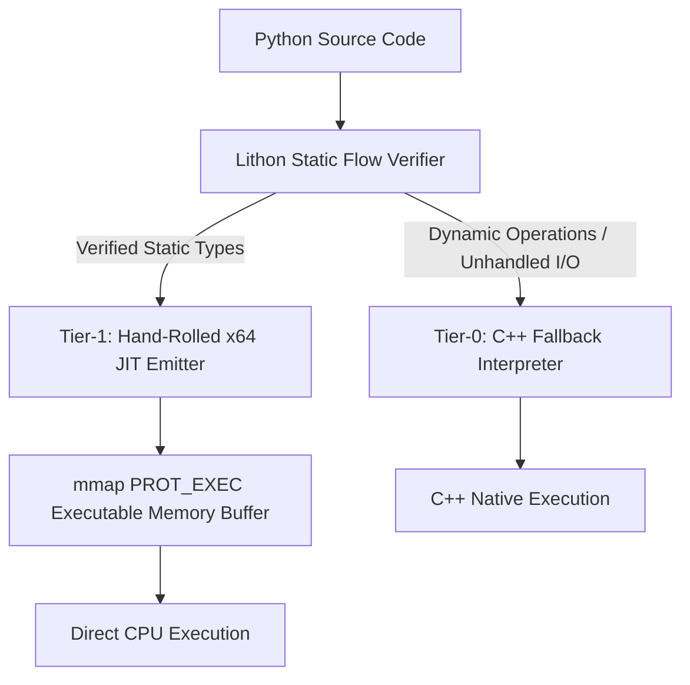

<div align="center">


# Lithon

### Give Python wings. Bare-metal speed with zero external dependencies.

[](https://github.com/Project-Lithon/lithon/actions)
[](https://en.cppreference.com/w/cpp/20)
[](https://en.wikipedia.org/wiki/X86-64)
[](#-quickstart)
[](#-what-is-lithon)
[](LICENSE)

</div>

---

<p align="center">
  
</p>

---

## 🚀 What is Lithon?

Lithon is a **zero-dependency, dual-tier execution engine** for a statically verified, Python-flavored language built for bare-metal performance.

It looks like Python. It reads like Python. But under the hood, Lithon makes a strict promise: **every variable has a proven, fixed type before execution begins.** No dynamic dispatch, no boxing integers on the heap, and no interpreter overhead on critical paths.

Rather than linking heavy compiler frameworks like LLVM or Cranelift, Lithon’s custom C++ engine compiles typed AST blocks directly into **raw, guard-free x86-64 machine instructions** and executes them in memory via native OS page allocation (`mmap` / `VirtualAlloc`). 

> **The Lithon Promise:** If a type flow cannot be mathematically proven safe and static, Lithon will refuse to compile it—ensuring slow execution paths never exist in your binary.

---

## ⚡ Quickstart

Lithon has **no third-party dependencies** — no LLVM, no runtime library, nothing
to `pip install` to make the engine work. It does need a toolchain and a
language, though, so the "zero dependencies" claim is about the *engine's*
inputs, not its build:

- CMake ≥ 3.20 and a **C++20** compiler (tested with GCC 12 and Clang 17)
- Python ≥ 3.10 — only for the compile step, which turns `.py` into IR. Once IR
  exists, the native program never touches CPython: no objects, no refcounting,
  no GC.

```bash
# 1. Clone
git clone git@github.com:Project-Lithon/lithon.git
cd lithon

# 2. Build the C++ engine. There is no Makefile; CMake drives everything.
cmake -B build -DCMAKE_BUILD_TYPE=Release
cmake --build build -j$(nproc)

# 3. Compile a .py program to IR, then run it on the native tier.
#    The frontend is the only step that involves Python.
python3 src/frontend/frontend.py tests/programs/float.py > /tmp/float.ir
./build/tier_runner /tmp/float.ir --strict
```

```text
[tier1] native
0.3333333333333333
0.30000000000000004
1.0
-0.0
1.0000000000000002
...
```

The `[tier1] native` line goes to **stderr**; the program's own output goes to
stdout. `--strict` means "native only, refuse rather than fall back", so a
successful exit status is proof the code was really emitted and executed —
that is the flag to use when testing, because `--auto` can hide a total
fallback to the interpreter behind correct output.

### The `lithon` command

`pip install -e .` adds a `lithon` wrapper that does the two-step dance for you.
It is optional — the engine works without it — and it installs into whichever
interpreter you point `pip` at, so check `lithon --version` agrees with the
`python3` you expect.

```bash
pip install -e .
lithon tests/programs/float.py            # auto: native when provably safe
lithon tests/programs/float.py --strict   # native only, rc=3 if refused
lithon tests/programs/float.py --ir       # print the IR and stop
lithon tests/programs/float.py -v         # show which tier ran, and why
```

`init.py` finds the frontend and `build/tier_runner` relative to the repo, and
honours `LITHON_HOME` and `LITHON_RUNNER` if you need to point it elsewhere.

> **Two layouts, one of them dead.** The tree carries a package layout
> (`__init__.py`, `__main__.py`, where `_ROOT` is the repo's *parent*) alongside
> the flat layout actually installed (`init.py`, `main.py`, where `_ROOT` is the
> repo root). `pyproject.toml` wires the flat one, so the package pair is dead
> code and `import lithon` raises `ModuleNotFoundError`. The `lithon` *command*
> works; the `lithon` *module* does not yet. Worth collapsing to a real
> `lithon/` package.

---

## 🏗️ Architecture: The 4-Language Integration Matrix

Lithon operates across four precise architectural layers, using each language exclusively where it excels:

| Layer | Language | Primary Responsibility |
| :--- | :--- | :--- |
| **Frontend** | Python | Expressive syntax, user logic, AST generation target |
| **Engine** | C++ (C++20) | AST parser, static flow verifier, type checker, memory manager |
| **Bridge** | C | SysV & Win64 ABI calling convention alignment |
| **Backend** | x64 Assembly | Bare-metal machine code generation (hand-encoded opcodes) |



---

## 🆚 How is Lithon Different?

| Feature | CPython | Cython / mypyc | PyPy | **Lithon** |
| :--- | :--- | :--- | :--- | :--- |
| **Primary Target** | Dynamic Bytecode | C Extension Source | Tracing JIT | **Bare-Metal x64 Machine Code** |
| **Typing System** | Dynamic | Optional / Annotated | Dynamic Tracing | **Mandatory Static** |
| **External Dependencies** | CPython Runtime | C/C++ Compiler | Heavy JIT Runtime | **Zero (Self-Contained Engine)** |
| **Startup Overhead** | High | Medium | Very High (Warmup) | **Instant (< 1ms)** |
| **Memory Allocation** | Boxed Heap Objects | Partial Unboxing | Traced Heap | **Raw Stack Registers / Unboxed** |
| **Memory Page Control** | None | OS Standard | Runtime Managed | **Direct `mmap` / `VirtualAlloc`** |

---

## 🎯 Primary Use Cases

Lithon is purpose-built for low-latency tasks where Python traditionally relies on external C/C++ wrappers:

- 🔢 **Numeric & Algorithmic Loops:** High-throughput mathematical sequences, signal processing, and matrix transformations.
- ⚡ **Quantitative Systems & Trading Logic:** Microsecond-level strategy execution without garbage collector pauses or JIT warmup latency.
- 🎮 **Performance-Sensitive Engine Tooling:** High-frequency game logic, spatial partitioning, and real-time data pipelines.
- 🛡️ **Predictable Micro-Utilities:** Deterministic, fixed-schema processing where memory and execution bounds must be guaranteed prior to runtime.

---

## 🧭 Roadmap to AOT Binary Synthesis

```text
  Phase I (Current)            Phase II (Next)             Phase III (Future)
┌──────────────────────┐    ┌──────────────────────┐    ┌──────────────────────┐
│ Dual-Tier JIT Engine │───►│ AOT Binary Synthesis │───►│ Zero-Copy C-FFI      │
│ In-memory mmap x64   │    │ Standalone <10KB ELF │    │ Direct Syscall Ops   │
└──────────────────────┘    └──────────────────────┘    └──────────────────────┘
```

- [x] **Phase I: Dual-Tier JIT Architecture (V1)**
  - Hand-rolled x86-64 machine code emitter in pure C++20.
  - Direct execution via `mmap` (`PROT_READ | PROT_EXEC`) and `VirtualAlloc`.
  - Static type flow analysis with deterministic Tier-0 interpreter fallback.
  - Full SysV and Windows x64 ABI compliance for C-level call compatibility.

- [ ] **Phase II: Ahead-Of-Time (AOT) Binary Compiler (V2)**
  - Direct ELF64 (Linux) and PE32+ (Windows) header synthesis.
  - Compile Python scripts into **standalone native executables (`.bin` / `.exe`) under 10 KB**.
  - Complete decoupling from the Lithon interpreter engine for standalone deployment.

- [ ] **Phase III: Systems & Hardware Integration (V3)**
  - Direct `syscall` (`0x0F 0x05`) instruction emission from Python syntax.
  - Zero-copy C pointer exposure and raw memory array mutation.
  - AVX2 / SIMD vectorization for parallel list processing (blocked: `1.3`
    VEX *encoding* is not built — `x86_encoder.h` emits no VEX-prefixed opcode
    yet, so there is nothing for a YMM instruction to sit on).

---

## 📍 Roadmap: Where Lithon Stands Today

*Current status, Phase I (Dual-Tier JIT). "Shipped" means enforced by a test that
fails when it regresses — not merely present.*

### Shipped and enforced

| Area | Status | Evidence |
| :--- | :--- | :--- |
| Hand-rolled x86-64 encoder | Shipped | `encoder_test`, `branch_test`, `stack_test`, `tools/check_encoder_vs_as.py` |
| SysV x64 ABI | Shipped | `src/jit/jit_abi.h`; `check_stack_alignment.py` (with `--self-test`) disassembles every function and proves callee-saved + 16-byte stack alignment at every call/ret |
| Windows x64 ABI | Implemented, **not yet verified** | `#if defined(_WIN32)` in `jit_abi.h`; the audit only exercises the host ABI, so the Win64 path has no test evidence yet |
| CPU target-feature detection | Shipped | `src/jit/cpu_features.h`; `cpu_features_test` (30 assertions) + `check_cpu_features.py` require CPUID to agree with the kernel (`/proc/cpuinfo`), so the AVX/AVX-512 gate cannot silently mis-detect |
| VEX/SSE transition discipline | Shipped (guardrail) | `tools/check_vex_transitions.py` disassembles each function and flags legacy SSE after VEX with no `vzeroupper`; no AVX is emitted yet, and `--self-test` proves the scanner fires |
| Tier-0 interpreter fallback | Shipped | `tier_runner --auto` falls back on unprovable output (`print_guard.h`) |
| Static type flow verifier | Shipped, **and unconditional** | `tools/typecheck.py`, `run_typed_regression.py` (14/14), `check_typecheck_unconditional.py`. Every module is checked, whatever it annotates — the three former gates (a no-annotation module, a `--ssa` module, `tier_runner` without `--ssa`) are gone. That gate had grown into a real hole: a module with no annotations anywhere was never checked at all, so the cheapest way to skip verification was to delete your type annotations. `check_typecheck_unconditional.py` now greps the sources for the gates so they cannot come back unnoticed, which matters because the removal itself is not observable from any single program |
| Conditional expressions | Shipped | `a if c else b`, nested; lowers to an SSA merge — `tests/programs/if_expr.py`, `tests/typed_regression/if_expr.py`, `fuzz_diff.py --phi` |
| Liveness + register allocation | Shipped | `liveness_test`, `regalloc_test` |
| IR text format | Shipped | `src/ir/text_parser.cpp` — no Python dependency in the engine |
| Function calls, recursion, TCO | Shipped | `compile_module_call_test`, `fib_test`; self-tail-calls become loops, O(1) stack |
| Float reassociation, opt-in | Shipped, **off by default** | `optimize_ffast_test`; `--ffast-math-equivalent` is the only way to enable it and no other flag implies it. Pins that the flag-off build stays bit-identical to the interpreter, and that enabling it really does move the answer (`2.0` → `1.0`) rather than only claiming to |
| Bitwise ops and shifts | Shipped | `& \| ^ << >>`, int-only; `check_encoder_vs_as.py` proves all 5 encodings against GNU as, `typecheck_test` pins the static rules, `tests/programs/bitwise.py` is a pure CPython-agreement test |

### Optimization pipeline (this is the active work)

Every optimization is independently switchable, so its effect can be measured
rather than assumed.

| Change | Lives in | Isolated measurement vs. HEAD |
| :--- | :--- | :--- |
| `strength_reduce_multiplies` — invariant × induction-variable → repeated add | `optimize.h` | **nested 1.062×** |
| `accumulator_unroll` — split a counted reduction's accumulator into N partials | `optimize.h` | **opt-in** (`--accum-unroll`); **float reduction 1.58×** (95.8 → 60.5 ms), integer `sum 20M` roughly neutral (within noise) — for a float accumulator it reassociates the adds, so the value is not bit-identical to the interpreter's |
| Callee-saved borrowing — temps live across a call borrow a callee-saved register instead of the stack | `register_alloc.h` | **fib 1.063×** |
| Shared virtual-temp liveness — one `VirtualTemps` set, excluded *before* live ranges are computed | `liveness.h` | correctness, not speed |
| `fold_constants`, `eliminate_dead_code`, `convert_self_tail_calls` | `optimize.h` | bundled, not isolated |
| `reassociate_float_adds` — rotate single-use float add chains to shorten the dependency chain | `optimize.h` | **opt-in only** (`--ffast-math-equivalent`); **not bit-exact** — `print(1e16 + -1e16 + 1.0 + 1.0)` goes from `2.0` to `1.0`. Off by default; the default build stays bit-identical to the interpreter. Fires 0 times on the typed corpus — no chains there yet |
| `mem2reg` + SSA copy resolution (`--ssa`) | `ssa.h` | correctness, not speed — removes 29 loads / 20 stores on `tests/typed_regression/if_expr.py` |

Measured on an Intel i3-3110M (Sandy Bridge), 12 interleaved rounds, CPU-time
clock, one pinned core. See [Testing](#-testing) to reproduce them yourself.

### Language and hardware phases, tracked

The phases below are specced and sequenced; this table is the honest status,
including the ones that are blocked and the two dependency questions that were
checked rather than assumed.

| Phase | What it adds | Status |
| :--- | :--- | :--- |
| 3.1 | `--ffast-math-equivalent` — float add reassociation, opt-in only | **Done.** Off by default; the default build is bit-identical to the interpreter. Fires 0 times on the typed corpus, so it is ready rather than earning |
| Float **return values** | Fixed | `Op::Return` materialised every result into RAX and `Op::Call` captured every result from RAX, but a `float[64]` return travels in XMM0 under both SysV and Win64. Calling such a function printed `0.0` and then a *different* near-zero denormal on each call, because the caller reinterpreted whatever stale bits sat in RAX as a double. Both halves needed fixing: the callee has to publish the double into XMM0 (`abi::kFloatArgReg`) and the caller has to capture the result through the float result path rather than RAX. Fixing only the caller side left the callee publishing nothing. Covered by `tests/programs/float_return.py` and `tests/typed_regression/float_return.py`; mutating either half makes the native tier diff fail (39/41) |
| Float **arguments** | Fixed | A `float[64]` parameter arrives in XMM0/XMM1 on both ABIs, never in a GP register, but the prologue spilled every parameter from `abi::kArgRegs[i]` and no `kFloatArgRegs` array existed at all. `def ident(x: float[64]) -> float[64]: return x` returned `0.0` for an argument of `9.75`, and passed *different* denormals on different runs because the slot held whatever unrelated integer bits were lying around. Passing a float and ignoring it happened to work, which is why nothing caught it. Three fixes: add `abi::kFloatArgRegs`; marshal float arguments into XMM at the call site; spill them with `movsd` in the prologue. Float parameters are also kept out of the allocator's promotion pass, since a promoted parameter would be copied from a GP register. For an **unannotated** float parameter the declared type is empty and tells the prologue nothing, so parameter kinds are now also inferred from call sites (`infer_param_kinds`, the same fixpoint `infer_value_kinds` runs), with the declared type taking precedence and `Unknown` falling back to the GP path. Covered by `tests/programs/float_return.py` (unannotated, also checked against real CPython) and `tests/typed_regression/float_return.py` (annotated); mutating the call-site marshalling, the prologue spill, or the inference each makes the native tier diff fail |
| 4.1 | `list[T, N]` — recursive `LType`, `Index`/`IndexStore`/`Len`, strided rbp addressing, static-only capacity overflow | **Type layer plus int and float codegen done, with packed stride.** `LType` carries an element type and `list[T,N]` round-trips through the IR text format; `Index`/`IndexStore`/`Len` are built, with list slots laid out in the frame, SIB-strided addressing, container-aware DCE, and lists excluded from register promotion. Bounds are checked two ways: a literal index is resolved at compile time, and a runtime index is emitted as a real signed-range trap. **No length field** — `Len` folds to the literal `N` and no code path can make a list's length anything else, so a mutable counter would be dead weight. No append, no assignment, no return, and **list parameters are rejected outright** (pass-by-value would need a bulk-copy emitter; passing by reference is `ptr[T]`'s job, and having both would mean proving two mechanisms agree). Nested containers are a *type* feature only — codegen rejects them, because an inner list makes the outer stride a non-power-of-two that SIB cannot express. Element stride is packed `sizeof(T)`, not a uniform 8 bytes, and that turned out to be **cheaper** than the layout it replaced rather than dearer: every scalar type is 1, 2, 4 or 8 bytes, which is exactly the set of factors the SIB byte encodes, so all four widths are one SIB form with no `lea` and no `imul`. Because stride and operand width coincide, a 4-byte element is just the same form with REX.W dropped. Three bugs lived in that new path and none of them showed up as a wrong *answer*: REX.W left set on a sub-8-byte access silently widened it and overwrote the next element; REX.R/REX.X gated on the width made a narrow access with an `r8`-`r15` register drop the extension bit and read a wild address; and an 8/16-bit load is a *partial* register write, so the low byte was right and every bit above it was leftover garbage. All three are now byte-covered against GNU `as` and mutation-proven. `list[float[32]]` is rejected explicitly rather than left unreachable by accident -- a 4-byte float stride is expressible, but the float value pipeline is all 8-byte doubles, and `movsd` into a 4-byte slot would overwrite the next element. `bool[N]` is rejected in `parse_type_annotation`: `bool` takes no width subscript, so `bool[8]` is a typo rather than a type  | **The frontend now reaches all of it.** `src/frontend/frontend.py` parses `list[T, N]` annotations (recursively, so a nested element type is expressible even though codegen rejects it), renders them back to the IR text form, lowers `xs[i]` and `xs[i] = v` to `Index`/`IndexStore`, lowers `len(xs)` to `Len` without first loading a list value that cannot exist, and emits a bare `xs: list[T, N]` as a valueless `store` -- the declaration is what reserves and zeroes the run, so unlike a scalar annotation it is not a no-op. `list_basic.py` and `list_strides.py` cover it and their outputs were checked against a CPython oracle using plain lists, not just recorded from the native tier. Two things had to be fixed to get narrow element widths reachable at all: a literal now narrows into a narrower element when it fits, matching what `x: int[8] = 2` already did, because the frontend cannot attach a width to a literal; and a `bool` element's kind is inferred as `bool` rather than folded into "not float, therefore int", which had made a bool list read back as int, join against the bool actually stored, collapse to unknown, and leave native refusing to compile a program the interpreter ran. |
| 4.2 | `tuple[T, N]` -- homogeneous, immutable; `IndexStore` into a tuple is a compile-time RCR error | **Done.** Homogeneous, exactly like `list[T,N]`: same packed stride, element 0 at offset 0, no length field. The two types differ by one rule -- a tuple cannot be written -- and that rule is a *typechecker* rejection, so the illegal program never becomes machine code and there is no runtime immutability check to pay for. Because the layout is identical, `Index`/`IndexStore` are reused rather than a second opcode being added, and every layer that already spoke `list` was found to speak `tuple` too, which is why the whole feature is the frontend kind list plus the checker. **Construction is a tuple literal on the annotated declaration**: `t: tuple[int[64],4] = (1, 2, 3, 4)`. That is the only way to get a non-zero value into a tuple, and without it a tuple could only ever hold zeros -- a bare declaration zeroes the run and every store is refused, so the type would have been a feature that could not carry data. The literal lowers to the declaration plus N ordinary `IndexStore`s, so there is still no 'construct a tuple' opcode and therefore no second place for immutability to be enforced. The interesting part is deciding *which* `IndexStore`s are construction. It is **not** enough to allow writes while the tuple is 'fresh': `store t : tuple[int[64],4]` followed by one `t[0] = 7` is textually identical to a one-element initializer for a four-slot tuple, so a write would pass as construction and immutability would depend on how many slots the type happens to have. The rule that separates them is that **a literal always writes all N**: untouched (a bare declaration, the all-zero tuple) is legal, fully written is legal, and *partially* written is an RCR error naming both counts. Tracking that is a linear per-block pass, deliberately not a dataflow one -- a tuple's initializer is the statements right after its own declaration, so construction cannot usefully cross a block boundary, and keeping it linear means there is no merge to define and no path on which a write stays legal because the analysis lost track of it. `len()` on a tuple is **rejected rather than folded to N**: it would have been free (N is static), but that is a separate decision, and folding an operation in because it happens to be easy is how a type starts promising things the language never agreed to. Parameters, returns and nested elements are rejected exactly as for `list`. Tests: `tuple_basic.py` is a genuine CPython oracle (annotations stripped, output identical), `tuple_strides.py` pins the packed stride for int[32], int[16], bool and float[64] and is mutation-proven against a one-sided stride corruption -- a *coarse* stride mutation does not work here, because the frame layout and the addressing call the same `container_element_stride` and move together, so the program stays self-consistently correct | **The frontend reaches all of it.** `tuple[T,N]` parses recursively, renders back to the IR text form, lowers `t[i]` to `Index`, and lowers the literal to the valueless declaration followed by one `IndexStore` per element. `tuple_basic.py` and `tuple_strides.py` are in the regression corpus (20/20) and the rejection rules are pinned in `typecheck_test`. Two things were load-bearing. First, a duplicated `out_scope_[block.label] = std::move(scope)` -- the second `std::move` stores an already-emptied scope, so every block's out-scope came out empty and *every* loop in the language failed to typecheck with 'not definitely assigned'; `while.py` was the canary. It is worth naming because the symptom pointed at loop-carried assignment and had nothing to do with it. Second, `bool` elements: inferring a container element's kind as 'not float, therefore int' makes a bool tuple read back as int, join against the bool actually stored, collapse to unknown, and leave the native tier refusing a program the interpreter ran |
| 4.3 | `dict[K, V, N]` — literal construction, `contains`, reads; open addressing into a fixed table | **Done.** Open addressing specifically, because chaining needs buckets that can grow without bound, which drags the heap back in. A dict is **three regions in the frame** rather than one run — keys, occupancy and values each ascend from their own base, because a lookup must reach three independent addresses; element offsets alone cannot describe it, so `DictLayout` is the single accessor, and the frame reserves it the same places list reservation happens (before promotion, so a dict can never become a promoted register — it has no single address to hold at all). Layout uses an explicit occupancy array rather than a sentinel key, because a sentinel either cannot store a key equal to it or silently corrupts the table. Hashing is Fibonacci/multiply-shift (one `imul` + `shr`, `0x9E3779B97F4A7C15`), chosen over identity hashing specifically to defeat keys that share a factor with the table size; keys canonicalize to their declared width and a `bool` key folds to 0/1 so the same bucket math serves every key type. The probe is **bucket & (N-1), all N slots** — the step count is what stops a miss on a full table, and it was once `N-1`: with every slot occupied, a probe stopped one bucket early and asked the wrong question (it was the one-change mutation that made the 4-key collision chain in `dict_table.py` instantly obvious). The walk tests **occupancy before key, never the reverse**: an empty bucket's key slot is uninitialized stack (only the occupancy array is cleared at declaration), so comparing a search key against it first lets stale bits false-match an empty table, skip the `dict key not found` trap, and return a garbage value slot. That one was found only by hand-built IR that looks up a key against a bare declaration (`TRAP_DICT_MISS` in the tier diff) — no program in the corpus had ever asked native code that question before, and it is why `garbage happens to equal the search key` is not a condition any codegen path may assume to be absent. The literal key's bucket is resolved **at compile time** because `DictStore`'s key is a constant by construction: a dict is built only from a literal, so the store never hashes at run time. `DictIndex` and `DictContains` take a runtime key (`d[k]` and `contains(d, k)`), hash and probe it, and differ only in the miss behaviour — `DictContains` reports False, `DictIndex` traps with exactly the interpreter's message. A bare `d: dict[K,V,N]` is the all-empty dict and is legal. Keys are `int[8..64]` or `bool`, values `int[8..64]`, `float[64]` or `bool`; `bool` and `int` are *distinct* key types (a bool key into an int dict is rejected, not coerced). **Immutability is stronger than for tuples**: a dict is built at its declaration and there is no `d[k] = v` at all — the frontend refuses it with the immutability message and the checker reports the same for hand-written IR, so `IndexStore` cannot reach a dict variable from either direction. `N` is a power of two checked in the typechecker and re-checked by the allocator for hand-written IR, and a literal may hold **at most N entries** (the load factor is one, so a full table is exactly representable and a fuller one is refused, not truncated or trapped at runtime). Dict parameters, returns and nested values are rejected outright (frontend and checker), like every container. **`str` keys are deferred**: `str` is type-checked as an allowed kind but has no storage and no codegen, so `dict[str, V, N]` stays blocked until a `str` storage phase exists, rather than smuggling string storage in as an undocumented part of dict. No deletion this phase; open-addressing deletion needs tombstones or backward-shift, with no feature currently asking for it | **The frontend reaches all of it.** `dict[K,V,N]` parses through the recursive `LType`, renders back to the IR text form, and a dict literal lowers to the valueless declaration plus one `DictStore` per entry. `dict_basic.py` is a genuine CPython oracle (annotations stripped, identical output); `dict_table.py` covers the two operations CPython cannot run — a bare declaration and `contains` — plus the four-key one-bucket chain `{1, 6, 9, 14}` at N=4 pinned by `dict_hash_test`, and its expected output is hand-written from the documented semantics rather than recorded, which the file's own header explains. Rejections (duplicate keys, over-full literal, non-power-of-two N, wrong-key-shape, narrow-out-of-range, nested values, immutability) are pinned in `typecheck_test`'s 4.3 cases. Three load-bearing fixes came out of the reachability work: the frontend's annotation unpack had to widen to six fields (`elem_kind, elem_width, key_kind, key_width, elem_elem_kind, elem_elem_width`) or every dict annotation crashed with a tuple arity error; a float `DictStore` used a *load* helper (`emit_movsd_xmm_rbp_scaled`) and stored bytes from the wrong slot until the matching `emit_movsd_rbp_scaled` existed; and literal keys had to be range-checked like list indices (a `-1` narrowing into `int[8]` is legal, a `100` is not) after negative-key folding landed. The phase-trialling also flushed out a latent 2.x bug that has nothing to do with dicts — `LivenessAnalysis` never stored its own `reverse_postorder()` result, so `coalesce_phi_registers` built an all-`-1` rpo table and its "is the register I am adopting still live?" check never fired; two merges coalesced onto a register a live temp still owned, and a loop with two conditionally-updated accumulators (a program with no dict in it at all) silently spun forever under `--ssa`. The one-line fix is in `liveness.h`, and the reproducers now match interpreter = JIT = `--ssa` (`dict_table.py` and `nodict.py` as an IR text case under `tests/`) |
| 4.4 | `ptr[T]` — `addressof`/`valueof`, `_`-prefix naming enforced at name and type together, element-scaled arithmetic lowered in the frontend to existing `Add`/`Sub` | **Done.** `LType` grows an `is_ptr`, `addressof` names a definitely-assigned plain scalar variable and yields `ptr[T]`, `valueof` loads the pointee through the pointer at the width named by its suffix, and the interpreter and JIT agree on every diff-testable case. Packed list stride is what makes the arithmetic coherent: the frontend lowers `_p + 1` to `add _p, sizeof(T)` (compile-time byte offset), both engines execute the same instruction, and the checker backstops hand-written IR by requiring a literal offset that is a multiple of the pointee stride. **Literal offsets only** (`_p + 1` is fine; a runtime offset is rejected loudly), `addressof` takes plain variables only, there is **no `null` literal** — `_p == 0` is an ordinary integer compare — and points stay in a frame: a variable named by `addressof` is excluded from DCE, from register promotion, and from SSA promotion, so it always has a live slot to point at. A pointer is never printed (refused guard → interpreter, and the typechecker rejects the source), pointers cannot cross a function header (the header records no pointee), and a pointer into a container or into another pointer is rejected where its pointee is still known. A `_`-named source variable must be a pointer and a pointer variable must be `_`-named, enforced in the frontend with a checker backstop. The naming rule came from C-lz-legibility: a pointer is written `_p`, its first character is the underscore. Dangling pointers remain out of scope by design — the compiler proves math, types and constraints, and does not attempt to prove that a raw address is valid. Interpreter `valueof` against an address nothing live owns is a deterministic trap, and tests never walk off a live cell (native reads stack memory there, so it is untestable) — only address *comparisons* and round-trips are diff-safe, and the tests stick to those |
| 4.5 | SIMD auto-vectorization and reduction | **Blocked.** 1.2 CPUID detection and 1.4 accumulator unrolling both exist, but 1.3 VEX encoding does not — `x86_encoder.h` emits no VEX-prefixed opcode, so there is nothing for a YMM instruction to build on. The VEX encoder is folded into 4.5 as its first task rather than reopened as 1.3; the dependency is identical either way. First target is `int[32]×8` **element-wise**, not float reduction, because it avoids the reassociation question from 3.1 entirely and proves the mechanism before floats add their own semantics. Safety prerequisites are non-optional: `vzeroupper` goes before **every** `ret` *and* every call site in a VEX-touching function — unconditional, because Lithon cannot see inside an opaque external call and so cannot know whether its internals use legacy SSE. Feature detection is one hoisted check per vectorized loop, from cached CPUID, with a scalar fallback |

### The SSA pipeline, phase by phase

The memory-based JIT is being converted to SSA one phase at a time, each phase
independently switchable so its effect can be measured rather than assumed. The
IR keeps mutable variables in memory — a variable is written by `Store` and read
by `Load`, exactly like a spill slot — so "promotion" here means turning those
into values that live in registers.

| Phase | What it adds | Lives in | Evidence |
| :--- | :--- | :--- | :--- |
| 2.1 | CFG, Cooper-Harvey-Kennedy dominators, natural loops, preheaders, latches, exits | `loop_info.h` | `loop_info_test`, `loop_canon_test` |
| 2.2 | Phi placement — iterated dominance frontier over each variable's def blocks (Cytron et al.) | `ssa.h` | `ssa_test` |
| 2.3 | Mem2Reg — promote promotable variables, place their phis, rewrite loads/stores away | `ssa.h` | `mem2reg_test` |
| 2.4 | SSA copy propagation + dead-value elimination, then `resolve_phis()` | `optimize.h` | `optimize_ssa_test` |
| 2.5 | Phi copies as register moves — each merge's edge stores become `mov reg, reg` instead of a memory round-trip | `register_alloc.h` | `phi_register_test` |
| 2.6 | Dedicated loop-exit-block synthesis — a loop exit that lands on a block something else can also reach gets its own block | `loop_info.h` | `loop_canon_test` |
| 2.7 | CFG liveness + interference-graph allocation, replacing the flat instruction-span model | `liveness.h` | `liveness_test`, `regalloc_test` |
| 2.8 | Register coalescing (IRC) — let a merge's destination reuse its source's register | both halves are done: `forward_trivial_phis` deletes same-operand merges, and `coalesce_phi_registers` gives a merge a dead source's register (5 across the corpus) |
| 2.9 | Direct `Op::Phi` — emit the merge at the edge that reaches it, so a promoted merge costs no code at all instead of costing `resolve_phis()` | opt-in via `--direct-phis`, which implies `--ssa`; `compile_module_direct_phi_test`; `run_tier_diff.py` sweeps both paths over the whole corpus (32/32 identical) |

Two decisions in that sequence are load-bearing, and both are the kind that
look like details until they produce wrong answers:

**Promotion is gated on a must-analysis, and the analysis iterates downward.**
A variable is promoted only if it is *definitely assigned* at every load and at
every planned Phi's incoming edge. The dataflow meets over predecessors by
intersection, and it iterates **down from "everything"** rather than up from
nothing, which converges on the greatest fixpoint. That is not a stylistic
choice: iterating upward, a variable assigned in a preheader and read inside the
loop collapses at the header to the meet of `{preheader}` and `{back edge}`, the
back-edge set never picks it up, and ordinary loop accumulators would be
silently un-promotable forever. Anything the analysis cannot prove stays in
memory, and `vars_declined` reports it rather than letting it pass unnoticed.

**`resolve_phis()` is a lowerer, not an emitter.** Because no codegen path emits
`Op::Phi`, resolution stores each incoming value on its predecessor *edge* and
turns the Phi itself into a load. This is what makes conditional expressions
work today, and it is correct — `--ssa` is differential-fuzzed against the
interpreter — but the merged value still round-trips through memory.

`find_loops()`/`LoopSpan` and the flat-span view they backed are **gone**. They
approximated a loop by the contiguous flat instruction span `[header, latch]`,
which is a superset when the body happens to be laid out contiguously and an
*underset* when it is not — and the underset was the dangerous direction, since
`extend_across_loops()` then failed to carry a value across the back edge past a
body block the span missed, making the value look dead where it was still live.
Phase 2.7 moved the allocator onto real CFG dataflow at the same time as those
consumers moved to `compute_loop_info()`, so the imprecise view no longer has
any callers to be wrong for.

One prerequisite of the emitter is landed, and one phase is half written:

| Phase | Would add | Why it is not already done |
| :--- | :--- | :--- |
| emitter | A direct `Op::Phi` case, so a merge is an opcode instead of a memory round-trip | **its liveness prerequisite is done**: `compute_edge_uses()` gives a Phi's operands to the predecessor they arrive on, instead of filing them as uses in the join. Still owed: value-kind inference for a float merge, an allocator slot for the result, and codegen for the join's parallel copies — and that last one is the same interference problem as 2.8, so the emitter relocates that work rather than shrinking it |
| 2.8 | Register coalescing (IRC) — let a merge's destination reuse its source's register | one half is done: `forward_trivial_phis()` deletes a merge whose operands all agree, so that copy set never exists (`ssa.h`, `ssa_test`). The other half is done too, and it had to be moved: `coalesce_phi_registers()` runs *after* the temporaries are coloured, since the register it claims is a temporary's and only allocation knows it. On the typed regression corpus it deletes 5 copies. Most merges still cannot benefit, and the write-up below says exactly why, by category. |

### Known gaps — the honest list

- **`Phi` is emitted directly, but only when asked.** `--direct-phis` (which
  implies `--ssa`) keeps the merges in the IR and emits each one on the edge
  that reaches it, so a promoted merge costs nothing; the default path still
  runs `resolve_phis()` and keeps the store-per-edge plus load-at-join shape.
  The default is unchanged on purpose — the flag is a differential-testing
  surface, not a shipped default, and `run_tier_diff.py` runs both over the
  entire corpus so the two are held to agreeing.
- **The edge copies are parallel copies, and that is not a formality.** The
  operands of a merge are all read at the instant the edge is taken, before any
  destination is written. The argument that no resolution is needed — "a Phi's
  result is a fresh ValueId, so no source is ever also a destination" — is true
  of ValueIds and false of *registers*, and it cost a wrong answer. Two values
  whose live ranges merely touch at the edge do not interfere, so the allocator
  is free to give them the same register; with the outer accumulator and the
  inner index sharing one, the copy that overwrites it runs before the copy that
  still had to read it, and the accumulator silently restarts every outer
  iteration. `typed_regression/nested_loop.py` printed `40` where `100` was
  correct — the final outer iteration's contribution alone, which is exactly
  what "reset every time" looks like. So `emit_phi_copies()` resolves the moves
  on locations: any destination that no pending move still reads goes first,
  and what remains is a cycle in the register graph, which is broken through a
  reserved scratch register (`r10`/`r11`, `XMM14`/`XMM15`) and emitted last. The
  test is pinned by mutating the resolution back into naive in-order emission,
  which reproduces the `40`.
- **The one kind of merge that costs nothing is already handled, and mostly by
  something older.** `forward_trivial_phis()` deletes a Phi whose operands all
  name the same value, which is what `c ? 1 : 1` becomes after propagation — a
  copy set that never had to exist, and a promotion-pool register never spent on
  it. Worth being precise about the payoff: on every shape the frontend currently
  produces, `copy_propagate()` gets there first, so this pass fires on none of
  them. It is a guard for a case the existing passes do not currently create, not
  a speedup — the unit tests construct that case by hand, since `phi` is an
  internal opcode the text parser cannot express. The guard is the interesting
  part: forwarding is refused unless the operand's definition dominates the join,
  and `ssa_test` pins that by building a Phi whose operand is *not* in scope on
  one of its own incoming edges.
- **`--ssa` does not compile modules that call other functions or that use a
  container.** This is a real gap, recorded rather than fixed. A call result has
  no source variable for the print guard to name, so it comes back an unknown
  kind, and a container register is not registered as something the guard can
  vouch for either. The effect is a refusal, not a wrong answer: such modules
  compile on the default memory path and `--auto` falls back. What is missing is
  the print-guard knowledge, not a lowering step — the front end builds both
  cases and the memory tier runs both. It is why the direct-Phi sweep reports a
  few *known gaps* alongside its matches instead of treating every rejection as
  a failure.
- **A merge's operands are live on an edge, which is not a place block-granular
  liveness has a term for.** The operand of a Phi in the join is read at the
  instant the predecessor's branch is taken — later than every ordinary use in
  that block. Filing it as a use *of the join* is wrong in both directions at
  once: it inflates the value's range backwards across the whole join, and it
  never records the thing that matters, that the value must stay alive to the
  end of the predecessor. A value whose last real use precedes the branch can
  then look dead, have its register reused by the very next instruction, and be
read clobbered by the copy — a silent wrong answer. `compute_edge_uses()`
   carries these per-edge instead, and `liveness_test` pins both halves: two
   operands sharing a predecessor *do* interfere, because both are needed at its
   end, while operands of *different* edges do not — the non-interference a
   coalescer will need.
- **A merge's destination can take over its source's dead register, which deletes
   that edge's copy outright.** `RegisterAllocator::coalesce_phi_registers()` runs
   *after* the temporaries are coloured, because the register being claimed is a
   temporary's and only allocation knows it — so every condition is a question
   about the interference graph, and the graph exists by then. For each merge it
   asks whether some incoming edge's source is a real register that nothing wants
   after that edge's store retires; if so the destination is given that register,
   and `materialize_into` elides the `mov` because source and destination are now
   the same register. The safety argument is one comparison: `last_use == the
   store`'s index means the source is dead the instant the copy retires, so the
   only thing left wanting the register is the merge itself. Four other conditions
   back it up — the source must be a register at all (a constant is virtual, and
   the copy that remains is an immediate, which is the cheapest form there is),
   the merge must not outlive a call unless the register is callee-saved, no other
   value's range may touch the merge's extent, and two merges may not claim one
   register. `phi_register_test` pins all three shapes: a dead arithmetic source
   coalesces, a source read again after the join does not, and constant sources do
   not. Mutating the `last_use` guard breaks the negative test, so the guard is
   load-bearing; mutating the clash guard breaks nothing, because with three
   temporary registers the corpus never puts two values in one register across a
   merge — that check is defence, and no test exercises it yet.
   **Honest size of the win: 5 merges across the typed regression corpus.** Most
   merges cannot benefit. `mem2reg()` runs first, so a merge's arms are already
   SSA values, and the ones that arrive are constants, another merge's value, or an
   arithmetic result still live somewhere else — the first has no register to
   adopt, the second means relocating a whole merge, and the third is refused.
- **The register budget bounds it.** A Phi copy gets a callee-saved register, of
  which there are five, and real variables rank for them first by loop-depth
  weight. So a merge-heavy program gets every copy in a register, while a
  function with more merges than registers keeps the memory path for the
  remainder — still correct, just not yet free. `--stats` reports the split as
  `phi copies: N of M in registers`; a shortfall is the budget, not a defect.
- **A merge carrying a double is never promoted.** A general-purpose register
  cannot hold a double, so those copies stay in memory by the same rule that
  governs every other float value. Closing that needs an XMM pool, which is
  2.7's.
- Net: **25 of the 26 IR opcodes are emitted.** The one missing one is `Phi`,
  still lowered by `resolve_phis()`.
- **Conditional expressions work, via that round-trip.** `a if c else b` has no
  stack-based lowering of its own: the frontend gives the result a compiler-
  generated temporary (`__ifexprN`), both arms store it, the join loads it, and
  Mem2Reg promotes exactly that pattern into a real Phi. The temporary has no
  annotation because it has no source variable, so the type checker infers its
  type from the arms — and rejects the program when the two arms disagree, since
  `1.5 if c else 0` is not "a float or an int", it is two different types.
  Nothing is left on the floor here; the merge is genuinely what SSA is for.
- **`--accum-unroll` reassociates float sums.** Splitting a float reduction's
  accumulator changes the rounding, so with that opt-in flag the native value
  can differ from the interpreter's (and from CPython's). The default pipeline
  never does this, and the tier-diff gate runs with the pass off, so bit-exact
  parity holds everywhere except when the flag is explicitly passed.

- **A loop exit that only the loop reaches is not given its own block.** Phase
  2.6 synthesizes a dedicated exit block only where it can do work: when the
  exit's target block has another predecessor, so the edge is genuinely shared.
  A target the loop alone reaches already *is* the exit block, and splitting it
  would add a block that jumps to a block that jumps onward — pure block-count
  inflation, and `loop_canon_test` asserts the pass declines to do it.

### `%` is C's `%`, not Python's

This is the one place where Lithon deliberately does **not** follow Python, so
it is worth stating plainly rather than leaving to a comment in `ir.h`.

```python
print(-7 % 3)   # Lithon: -1     CPython: 2
print(7 % -3)   # Lithon:  1     CPython: -2
```

`%` truncates toward zero and takes the sign of the **dividend**, which is what
C, Rust, Java and every other compiled language do. CPython floors instead, so
its remainder has the sign of the **divisor**. Both engines here implement the
truncating rule, which is what makes the tier diff a meaningful check rather
than two engines agreeing on a shared mistake.

The reason is the one C gives: a remainder never leaves the domain of its
operands, so `Mod` is typed like `Mul` (int iff both operands are int) rather
than like `Div`, which must widen to float because a quotient generally is not
an integer. Typing it as `Div` would make `7 % 3` a `float` and lose the point.

Consequences worth knowing, all covered by tests:

- A zero divisor **traps** on both engines, like `Div`, with its own message
  (`modulo by zero`) so the two are distinguishable in a diff.
- `INT64_MIN % -1` is `0`. It is the one input that makes hardware `idiv` raise
  `#DE`, since the quotient would be 2⁶³, so the divisor is tested up front and
  the whole division collapses to a zero.
- Float `Mod` has **no SSE2 instruction** — `fmod` is a libm call, and calling
  one per modulo would be far more expensive than the interpreter this is
  meant to be replacing. It is computed as `a - n*b` for `n = trunc(a/b)`, the
  definition C uses. The interesting case is `n == 0`, which happens exactly
  when `|a| < |b|`, and it is the *only* case where the multiply can go wrong:
  IEEE makes `0 * inf` a NaN, but `n*b` is 0 for every `b` when `n` is 0, so
  C's `fmod(1.0, inf)` is `1.0`. The guard that skips the multiply has to
  distinguish a real zero quotient from a NaN one using the same `ZF AND !PF`
  shape as the zero-divisor check, because `comisd` sets ZF for an unordered
  compare too.
- A zero remainder is normalized to `+0.0` to match CPython, which does not
  preserve the dividend's sign for a zero remainder. C's `fmod(-4.0, 2.0)` is
  `-0.0`; Lithon prints `0.0`. This is a conscious divergence, chosen so the
  float and integer paths agree with each other.

Integer `Mod` is also strength-reduced where it is exact: a constant divisor
that is a power of two becomes a mask plus a sign fixup, since `-7 & 3` is `1`
and not the `-3` that `-7 % 4` has to return.

### Shifts are 64-bit, and their counts are checked

`&`, `|`, `^`, `<<` and `>>` are integer-only, and each is a plain 64-bit
machine operation. `>>` is arithmetic (`sar`), so `-8 >> 1` is `-4`.

Three rules follow from "the machine word is 64 bits wide", and all three
diverge from CPython, whose ints are unbounded:

```python
print(5 << 63)     # Lithon: -9223372036854775808   CPython: 46116860184273879040
print(5 << 62)     # Lithon:  4611686018427387904   CPython: 4611686018427387904
print(1 << 64)     # Lithon: RCR error              CPython: 18446744073709551616
```

- **Left shifts wrap.** `5 << 63` is `2**63 + 2**65`; only the low 64 bits
  survive, which is `-2**63`. Nothing is trapped and nothing is auto-widened,
  because there is no wider type to widen to. `5 << 62` happens to agree with
  CPython — that is arithmetic luck, not a rule.
- **A count outside `0..63` is refused**, at compile time when the count is a
  literal and at run time when it is not. x86 masks the count to its low 6
  bits, so `1 << 64` would execute as a shift by `0` and return `1`, and
  `1 << -1` would shift by `63`. Lithon raises an error rather than returning
  the wrong answer. `1 << 64` is a program that cannot run.
- **No float punning.** `2.5 & 1` is a type error. There is no float bit
  pattern in Lithon to reinterpret, and inventing one would mean `&` means two
  different things depending on its operand types.

The result width is the **left** operand's width, so `a & b` with `a: int[8]`
is an `int[8]` and may be stored without narrowing. A shift into a target too
narrow to hold the result is rejected statically when the count is a constant
(`100 << 3` is `800`, which is not an `int[8]`).

The encodings are the ones x86 actually has, and which one is used depends on
whether the count is known at compile time — visible only in the generated
code:

```console
$ build/tier_runner prog.ir --dump-hex   # then: objdump -D -b binary -m i386:x86-64
shl rax,0x3      # 48 c1 e0 03   literal count 3, never touches CL
shl rax,1        # 48 d1 e0      literal count 1, the 2-byte short form
shl rax,cl       # 48 d3 e0      dynamic count
sar rax,cl       # 48 d3 f8      dynamic count
```

A dynamic shift has to be careful about RCX, which is a member of `kTempPool`
on POSIX and so can be holding the shift's own result. `shl rcx, cl` would
shift a register by its own low bits, so the result is computed in R10 and
moved into RCX — *after* the `pop` that restores the count, or the `pop`
overwrites the result with the count itself. `run_tier_diff.py`'s
`adversarial/dynamic_shift_rcx_dst` pins that exact allocation.

### Floating point, and what "identical" had to mean

`float` is implemented end-to-end: `ConstFloat`, load/store, `Add`/`Sub`/`Mul`/
`Div`/`Mod`, the three comparisons, and native `print()`. Both tiers now run
`float.ir`, `mixed_numeric.ir` and `comparison.ir` natively, with
`run_tier_diff.py` reporting 37/37 native and zero interpreter fallbacks.

The hard part was not the arithmetic — SSE2 is straightforward once the
encoding is right — it was making the two engines agree *byte for byte*, since
that is the property everything else is measured against:

- **Formatting is one function, called by both.** `host_format_double()` in
  `float_runtime.h` is what emitted code calls and what the interpreter calls.
  CPython's rule is the *shortest string that round-trips*, so neither `"%f"`
  (which prints `3.500000`) nor `"%.17g"` (which prints `0.10000000000000001`)
  is acceptable. `%.*g` is also wrong in a way that is easy to miss: it chooses
  exponent notation based on the *precision it needed*, whereas CPython's
  threshold is absolute — decimal exponent below −4 or above 16. That is why
  `924966630.0` must print in full, not as `9.2499663e+08`.
- **`Div` by zero traps on both engines**, matching Python's
  `ZeroDivisionError` rather than IEEE `inf`/`nan`. The check cannot be a
  single branch: `comisd` sets ZF, PF *and* CF together when the operands are
  unordered, so ZF alone cannot separate "equal" from "NaN". The emitted code
  computes `ZF AND !PF` in a GP register instead. A **NaN divisor must not
  trap** — Python propagates — and `-0.0` must, since it compares equal to `0.0`.
- **NaN compares false against everything**, including itself. The same
  unordered-flag problem applies to `Lt`/`Gt`/`Eq`, and is excluded with
  `setcc` + `AND setnp` rather than a parity branch: `0F 9A` is a byte-for-byte
  collision between `jp rel32` and `setp r/m8`, so a parity `Jcc` is not
  encodable here.
- **`--ffast-math-equivalent` trades the last bit for a shorter dependency
  chain, and is never applied without being asked for.** Reassociating float
  addition is not an optimisation in the sense every other pass here is. FP
  addition is not associative: `(a+b)+c` and `a+(b+c)` are the same real number
  and, in general, different doubles. So this pass gives up a proven property —
  bit-exact agreement with the interpreter, which is what the entire test gate
  measures against — and the only thing that makes it acceptable is that it is
  off by default, is implied by no other flag, and is named after the thing it
  does rather than after a speedup. Integer arithmetic gets no such pass and
  needs none: integer addition is associative *and* exact, so regrouping it would
  be free and pointless.

  What it does, where an add's left operand is itself a single-use add:

  ```
  %t = add %p, %q        %u = add %t, %r     ->    %u = add %p, %new
                                                 %new = add %q, %r
  ```

  which drops one level off the chain; repeated, a left-leaning spine of N
  dependent adds becomes a tree closer to depth log₂(N).

  **The tradeoff, measured, not asserted.** With `a=1e16, b=-1e16, c=1.0, d=1.0`
  and `print(a + b + c + d)`:

  | | result |
  |---|---|
  | interpreter | `2.0` |
  | native, flag off | `2.0` |
  | native, `--ffast-math-equivalent` | `1.0` |

  Left-associated, `((1e16 + -1e16) + 1) + 1` is `2.0`. Reassociated,
  `1e16 + ((-1e16 + 1) + 1)` is `1.0` — and not by one ULP: `1e16` has a ULP of
  2, so the `1.0` in `-1e16 + 1` is rounded away entirely and the answer moves
  by a whole unit. Anyone turning the flag on should read that table first.
  `optimize_ffast_test` pins all of it, including that the flag-off build still
  returns `2.0`; mutating the flag gate, the single-use guard, or the
  declaration of the float values the pass invents each break a check.

  **Honest size of the win: zero rotations across the typed regression corpus.**
  The pass works — the table above is real output — but nothing in that corpus
  presents a chain. Its float work is accumulator reductions, which after
  `mem2reg` are one add per iteration rather than a left-leaning spine, and
  `fold_constants` runs first, so a chain of literals has already become one
  constant by the time this pass sees it. So the value of this today is that the
  flag exists, is honestly labelled, and is ready — not that it is earning
  anything on the current programs.
- **A float live across a call spills.** Every XMM in the temp pool is
  caller-saved on both ABIs, and `host_format_double` is an ordinary C function
  that clobbers all of them, so leaving a float in one across a `call print`
  silently corrupts it.
- **The guard refuses a variable stored both an `int` and a `float`.** Its kind
  joins to `Unknown`, and codegen only asks `is_float_value` — so it would lower
  the arithmetic as *integer* operations over a double's bit pattern. Printing
  the resulting `bool` hides this, because a comparison is always `bool` and so
  always passes the print check.

These are pinned by `float_format_test` (CPython `repr` transcribed by hand),
the SSE2 byte-exact assertions in `encoder_test`, and a dedicated
`tools/fuzz_diff.py --floats` mode — the general fuzzer annotates every variable
`int[64]` and so never reached any of it.
- **Arguments are capped at 2 per function and per call.**
- **Branchy loop bodies are not unrolled.** The unroller is implemented,
  correct, and fuzzed — but it measured **1.10× slower** on an if/else loop
  (1.05× with a heavier body), because a diamond's if/else test is irreducible
  and unrolling only inflates the loop ~2×. It is therefore **opt-in** behind
  `--unroll-diamonds`, not deleted.
- **No AOT backend.** Everything runs in-process; there is no `.bin`/`.exe` emit.
- **x86-64 only.** No ARM64 backend.

### Next

1. **`Phi`** — the last unemitted opcode, needed for `if`-as-expression
   lowering once both arms must merge without a stack round-trip.
2. **Lift the 2-argument cap** — most remaining test programs are blocked on it.
3. **ARM64 backend** — the genuinely arch-agnostic layers are `ir/`, `liveness.h`,
   and `optimize.h` (they name no registers at all). `register_alloc.h` names
   registers only via `abi::kPromotionPool`. The x86-specific surface is
   `x86_encoder.h` plus the emit calls in `compile_function.h`. `float_runtime.h`
   is in that last group only in the sense that its formatter is shared — the
   arithmetic and its `ZF AND !PF` zero test are not.
4. **AOT emit** — Phase II below.

> **Note:** Phase I is a work in progress. The engine is fast and well-tested on
> the subset it supports, and it **refuses** what it cannot prove — that refusal
> is the feature, not a workaround.

---

## 🧪 Testing

Work outward and stop when you are satisfied. Each layer is roughly an order of
magnitude slower than the one above it.

### Build

```bash
cmake -B build -DCMAKE_BUILD_TYPE=Release
cmake --build build -j$(nproc)
```

If you are on a machine with a small `/tmp` (a 100 MB tmpfs is enough to fail
this), point the compiler's scratch space somewhere roomier:

```bash
TMPDIR=/path/to/scratch cmake --build build -j$(nproc)
```

### Layer 1 — unit tests (~0.1 s)

```bash
ctest --test-dir build --output-on-failure        # 28/28
```

The tests are not all the same kind, and it is worth knowing which is which:

- **`liveness_test`, `regalloc_test`** — pure analysis tests. They build IR and
  call the pass directly, and never emit a byte. A green run here means the
  data structures are right, not that any machine code ran.
- **`loop_canon_test`, `ssa_test`, `mem2reg_test`, `optimize_ssa_test`** — the
  same shape, one level up: CFG/dominator analysis, Phi placement, promotion
  (including the cases that must *decline*), and the SSA copy/DSE passes. They
  assert structure rather than values, which is what catches "the merge is in
  the wrong block" — the failure mode a differential test reports only as a
  wrong number.
- **`compile_function_*`, `compile_module_*`, `optimize_lsr_test`,
  `optimize_accum_test`** — compile a module to machine code, mmap it, and call
  it through a function pointer, checking the returned values. These are the
  tests that would catch a bad encoding. `optimize_accum_test` also asserts the
  structural shape the accumulator pass must produce (one terminator per split
  block, the partial stores before it), which is what a dead-clone regression
  would violate.
- **`cpu_features_test`** — no IR and no machine code: it checks the CPUID
  parsing and the `usable_avx`/`usable_avx512` gating against pinned raw
  feature bits and a `--dump` of the host, so the AVX/AVX-512 gate can be
  trusted on machines the CI host is not.
- **`encoder_test`, `stack_test`, `branch_test`, `print_guard_*`** — the
  x86/ABI layer underneath, tested in isolation.
- **`float_format_test`** — pure computation, no JIT, no interpreter. Pins
  `host_format_double` against CPython's `repr` with expectations *transcribed
  by hand* rather than generated from the code under test, since generating
  them would only prove the formatter agrees with itself.
- **`compile_module_float_test`** — needs real machine code, so it is
  POSIX-only and uses `fork`: a float live across a call, a NaN divisor that
  must propagate, and `0.0` / `-0.0` divisors that must trap. The last two run
  in a child process because the trap handler calls `exit(1)`.

### Layer 2 — the full gate (~2 min)

```bash
bash tools/verify_all.sh                         # ctest, encoder-vs-as, CPUID, VEX, regressions, tier-diff, fuzz, ABI audit
python3 tools/run_regression.py                  # 15/15 untyped programs
python3 tools/run_typed_regression.py            # 13/13 typed programs
python3 tools/run_tier_diff.py                   # 39/39
```

`run_tier_diff.py` is the highest-value of the four. It runs every program
through **both** tiers and requires byte-identical stdout, and it reports which
tier actually ran — so a green run cannot hide "everything silently fell back
to the interpreter".

### Layer 3 — differential fuzzing (~5 min per mode)

```bash
python3 tools/fuzz_diff.py --count 300             # general programs
python3 tools/fuzz_diff.py --count 300 --lsr       # strength-reduction shapes
python3 tools/fuzz_diff.py --count 300 --diamond   # diamond-unroll shapes
python3 tools/fuzz_diff.py --count 300 --floats    # int/float mixes, div, calls
python3 tools/fuzz_diff.py --count 300 --bitwise   # & | ^ << >>, both encodings, count bounds, RCX hazard
python3 tools/fuzz_diff.py --mod --count 300       # modulo, any signs
python3 tools/fuzz_diff.py --mod-negatives --count 300   # modulo, negative operands
python3 tools/fuzz_diff.py --phi --count 300       # conditional-expression merges, run with AND without --ssa
python3 tools/fuzz_diff.py --phi --floats --count 300    # ...over float merges
python3 tools/fuzz_diff.py --accum --count 300      # accumulator-unroll shapes (--accum-unroll)
```

The JIT's output is compared against the interpreter, and the interpreter's
against CPython — reported **separately**, because Lithon deliberately diverges
from CPython for loop variables (`v == n` after a loop, not `n - 1`), so a
CPython disagreement is not by itself a bug in the JIT. The `--lsr` and
`--diamond` modes exist because the general
generator almost never reaches those two passes; without them they would be
essentially untested. `--floats` exists because the general generator annotates
every variable `int[64]` and so emits no `const_f64` at all — that mode found a
real miscompile (an `Unknown`-kind operand lowered as *integer* arithmetic) that
four general modes had never approached.

`--mod-negatives` is the mode to reach for when changing modulo, with one caveat:
because Lithon's `%` truncates and CPython's floors, most of its CPython
disagreements are *expected* language gaps rather than bugs, and the mode reports
them separately. The number that must stay at zero is the interpreter-vs-JIT
mismatch count. Neither modulo mode generates infinities or NaNs, so the
`0 * inf` class of bug needs the adversarial `run_tier_diff.py` case instead.

`--phi` is the only mode whose programs *need* a merge to be correct, so it is
the only one that tests Mem2Reg, Phi placement and copy resolution end to end.
It runs each program twice — plain `--auto` and `--auto --ssa` — and requires
both to match the interpreter, which turns "the pipeline changed the answer"
into a failure rather than a silent pass. That the harness can actually fail was
verified by mis-assigning Phi operands to the wrong predecessor: 25 of 25
programs mismatched immediately.

Mismatches are written to
`fuzz_failures/`, minimised,
and printed.

### Layer 4 — read the generated code

Often the most convincing check, because it needs no timing and no baseline:

```bash
./build/lithon_jit nested_loop.ir --dump-code /tmp/n.bin
objdump -D -b binary -mi386:x86-64 -M intel /tmp/n.bin

# Did strength reduction fire? nested_loop has one multiply per inner iteration.
objdump -D -b binary -mi386:x86-64 -M intel /tmp/n.bin | grep -c imul     # 0 = fired

# Same program with the pass disabled, to prove the above was the pass's doing.
./build/lithon_jit nested_loop.ir --no-lsr --dump-code /tmp/n2.bin
objdump -D -b binary -mi386:x86-64 -M intel /tmp/n2.bin | grep -c imul   # 4
```

### Proving an optimization individually

Every optimization is toggleable, so a claim can be checked rather than taken on
trust. This is how the numbers in [the roadmap above](#-roadmap-where-lithon-stands-today)
were established:

```bash
./build/lithon_jit prog.ir --no-opt          # constant folding + DCE
./build/lithon_jit prog.ir --no-promote      # register promotion
./build/lithon_jit prog.ir --no-rotate       # loop rotation
./build/lithon_jit prog.ir --unroll=1        # all loop unrolling off
./build/lithon_jit prog.ir --no-lsr          # strength reduction
./build/lithon_jit prog.ir --accum-unroll    # opt in to accumulator splitting (~1.6x on a float reduction; reassociates FP)
./build/lithon_jit prog.ir --unroll-diamonds # opt in to diamond unrolling
./build/lithon_jit                          # full flag list
```

`tier_runner` takes `--no-lsr`, `--accum-unroll`, and `--unroll-diamonds` too,
which is what the fuzzer uses; the other four are currently `lithon_jit` only.
`tools/native_bench.py --only float --runner-args='--accum-unroll'` measures the
opt-in pass end to end (the `float reduce 20M` workload is its target).

### Benchmarks

Use the existing harness — it ships the four official workloads plus three
stress cases, reports a **noise** column, and warns that results are unreliable
above ~15% noise.

```bash
python3 tools/native_bench.py --runs 30 --pin 2
```

To compare two states, write a baseline first and compare against it:

```bash
python3 tools/native_bench.py --runs 30 --json /tmp/before.json
# ...change something, rebuild...
python3 tools/native_bench.py --runs 30 --compare /tmp/before.json
```

> **Two traps.** **Always pass `--pin <cpu>`.** Unpinned, one run showed 26%
> noise on `branchy` and the numbers were unusable; pinned, the same comparison
> was stable to ~0.01 ms. And **do not** point `--compare` at
> `benchmarks/results/*.json` — those were written by `tools/bench.py`, which has
> a different schema and different workload names, so the `vs before` column
> comes out **silently empty** rather than erroring. Both sides must come from
> `native_bench.py`.

> **Read `min`, not `median`.** Noise from other processes, frequency scaling
> and cache state only ever *add* time, so the minimum is the least contaminated
> estimate. Differences under ~5% are not meaningful on a shared machine.

### What a green run does not prove

The test suite covers the subset of the language the engine supports today.
Floats, `Div` and `Mod` now work, so they have moved out of the gaps list; what
remains unimplemented is a `Phi` *emitter* and support for more than two
arguments, and those are listed
[above](#known-gaps--the-honest-list) precisely so a green run
is not mistaken for a complete one. If you add support for one of them, the
honest next step is to move it out of that list.

Two more limits worth stating plainly, because a passing run can obscure both:

- **Opcode coverage is not operand coverage.** 25 of 26 opcodes are emitted and
  each is exercised through `tier_runner --strict`, so a pass proves the opcode
  was genuinely executed natively rather than fallen back. It does *not* prove
  every operand shape is right — that is what `encoder_test`'s byte-exact
  assertions and the fuzz modes are for. `gt` and `not`, for instance, have a
  single native use each in the checked-in `.ir` corpus. `Mod` is a standing
  example of why the two are different: the general fuzzer only ever emits
  finite constants, so it cannot generate `1.0 % inf`, which was returning NaN
  natively while the interpreter was correct. That case is pinned by an
  adversarial `run_tier_diff.py` entry that *requires* the native tier, so a
  future guard change cannot make it silently fall back and hide the bug.
- **The interpreter is an oracle, not a specification.** Where Lithon and
  CPython disagree, `run_tier_diff.py` reports it separately as a language gap
  rather than a JIT bug — loop variables are one known case, deliberate. That
  is correct for *this* project, but it does mean the suite cannot catch a bug
  where both engines share the same wrong idea.

---

<!-- MAMBA:BENCHMARK:START -->

## ⚡ Latest Benchmark

| Benchmark | Lithon JIT | Reference | Speedup | Result |
|---|---:|---:|---:|---:|
| fib(30) | 6.3195 ms | 1137.8649 ms | 180.1× | 832040 |

**Status:** PASS

_Last updated by Lithon Reporter Mamba._

<!-- MAMBA:BENCHMARK:END -->

---

## 📜 License

Lithon is released under the [MIT License](LICENSE).
